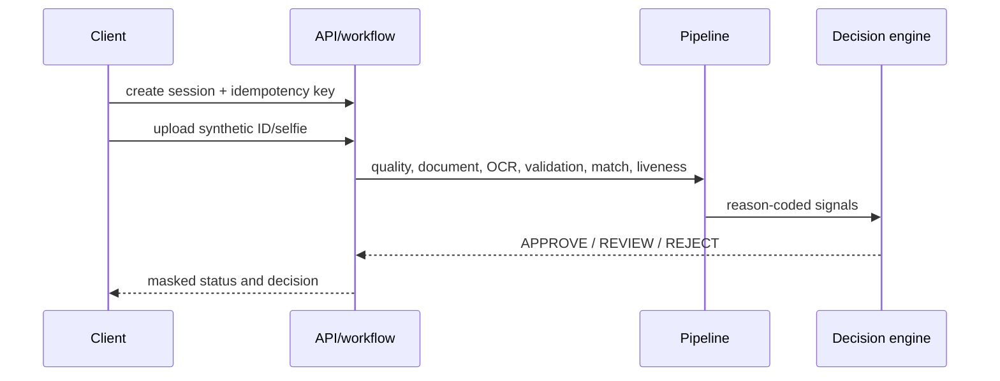

# KYC Verification Demo

An end-to-end, **synthetic-data-only** KYC decisioning demo: ID capture, quality signals, OCR-ready extraction, deterministic validation, face/liveness adapters, risk verdicts, and an append-only audit trail.

> **Safety and scope:** This repository never accepts real CNICs in its fixtures or demos. Generated cards are visibly labelled `SAMPLE — NOT A REAL ID`; it does not validate against NADRA or any government database. It validates format and internal consistency only.

## Status

| Measure | Result |
| --- | --- |
| OCR accuracy | TBD (not yet measured) |
| Decision evaluation | TBD (not yet measured) |
| Default retention | 24 hours for encrypted raw artifacts |

## Architecture



## Quickstart

Requires Python 3.11+ and [uv](https://docs.astral.sh/uv/).

```powershell
uv sync --all-groups
Copy-Item .env.example .env
uv run pytest
uv run uvicorn kyc.api.main:app --reload
```

Use `X-API-Key: development-client-key-change-me` for client endpoints and the admin key for `/admin` endpoints in development. Replace both values outside a local demo.

## Design and limitations

Read [docs/DESIGN.md](docs/DESIGN.md), [docs/PRIVACY.md](docs/PRIVACY.md), [docs/LIMITATIONS.md](docs/LIMITATIONS.md), [DATA.md](DATA.md), and [MODEL_CARD.md](MODEL_CARD.md) before treating this as more than a portfolio demonstration.

## License

MIT. See [LICENSE](LICENSE).
